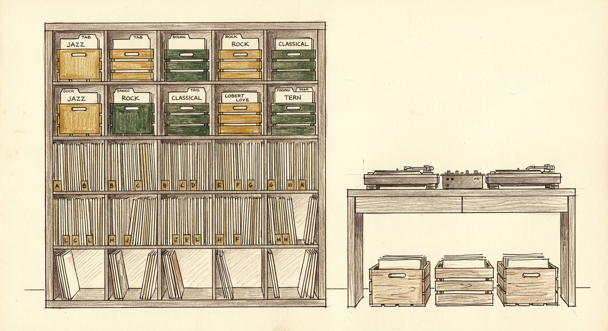
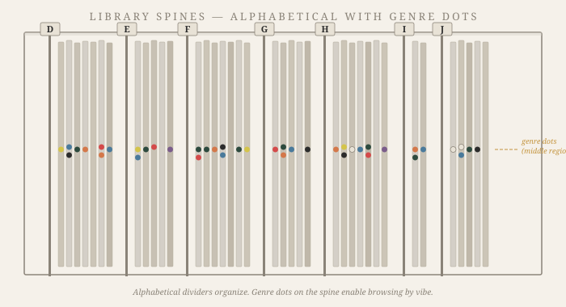
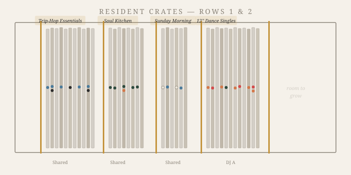
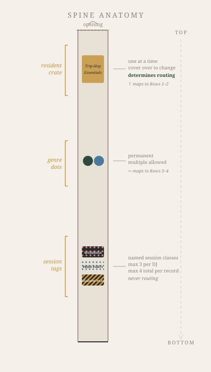
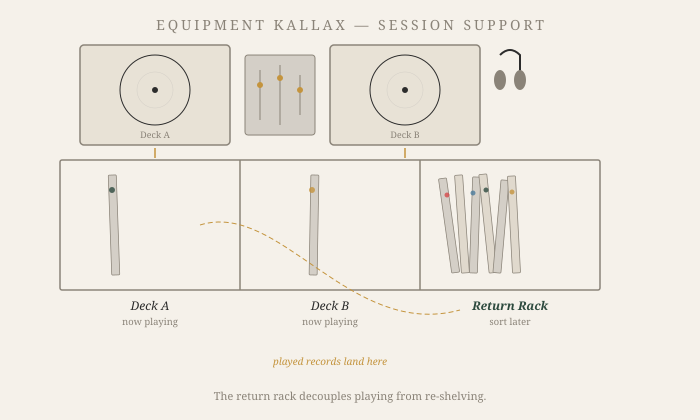
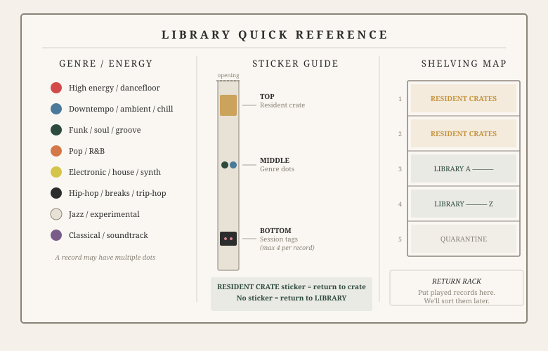

## The problem with genre bins

Every record store sorts by genre. Walk into any shop and you'll find the familiar islands: rock, jazz, electronic, soul. It works because the store's staff made the classification decision once, and customers are browsers — they don't need to put things back.

A home library is different. Records leave and return constantly. They migrate from shelf to turntable to crate and back again, sometimes days later, sometimes weeks. Each return demands a decision: *where does this go?*

When one person makes that decision, the system holds. When two people make it — two people with different mental models of what constitutes "electronic" versus "pop," different relationships to the word "experimental" — the system drifts. A record filed under jazz by one DJ gets returned to electronic by the other. Neither is wrong. But the record is now in a place where neither expects to find it.

This is the shared crate problem. Not a problem of storage, but of *consensus* — or rather, the impossibility of maintaining it across subjective classification at the point of every re-shelving.

## The studio as instrument

The collection in question lives in a studio space shared by two DJs. Two turntables, a mixer, a pair of monitors, and roughly 750 records organized across a 5×5 Kallax shelf — the ubiquitous IKEA unit that has become the *de facto* standard for vinyl storage.

The library is not a collection in the archival sense. No one here is chasing first pressings or Japanese imports for their own sake. The records exist to be played — in practice sessions, in collaborative sets, in spontaneous evenings where a guest DJ arrives with a small crate of their own and wants to browse the shelves for something unexpected.

This orientation — the library as *live performance instrument* — shapes every design decision that follows. The system must optimize for two activities above all others: pulling a record quickly, and returning it without ambiguity.

## Two modes of recall

The two DJs who share this library navigate it differently.

One DJ hears a track and can surface the artist name, the album, often the label and year. Their recall is key-value: given a sonic input, they retrieve a precise identifier. Alphabetical sorting works beautifully for this mind. You want Portishead? Go to P.

The other DJ thinks in textures. They remember a *feeling* — the quality of a particular bassline, the way a record felt at 2am, the genre-adjacent space between trip-hop and downtempo where certain records live. Their recall is associative, not indexed. They don't always remember the artist name first. They remember the vibe first, and the name follows — sometimes.

Any system that serves only one mode of recall fails the other. Pure alphabetical sorting is fast for lookup but offers nothing to the browser who thinks in moods. Pure genre sorting serves the browser but, as established, collapses under shared re-shelving.

The design challenge: serve both modes without requiring either DJ to adopt the other's cognitive style.

## The solution: fixed position, floating metadata

The core insight is a separation of concerns borrowed, perhaps unconsciously, from database design. The *physical position* of a record is determined by one axis only: alphabetical by artist name. This is the primary key. It never changes, it requires no judgment call, and it gives every record in the library exactly one unambiguous home.

Genre, mood, energy — all the associative metadata that the second DJ needs — lives not in the physical arrangement but in a *visual overlay*: small colored dot stickers applied to the spine of each record's archival outer sleeve.

A record can carry multiple dots. A Massive Attack album might wear both a blue dot (downtempo) and a black dot (hip-hop lineage). A Sade record might carry orange (pop/R&B) and green (soul/groove). The dots don't determine where the record lives — it lives at its alphabetical position regardless — but they allow a browsing DJ to scan the spines and see genre at a glance.

The dot categories, as finalized for this collection:

| Color | Genre / Energy |
|---|---|
| Red | High energy / dancefloor |
| Blue | Downtempo / ambient / chill |
| Green | Funk / soul / groove |
| Orange | Pop / R&B |
| Yellow | Electronic / house / synth |
| Black | Hip-hop / breaks / trip-hop |
| White | Jazz / experimental |
| Purple | Classical / soundtrack / spoken word |

These categories are deliberately coarse. They are not musicological taxonomy — they are *wayfinding*. A DJ scanning for "something funky" looks for green dots. A DJ building a downtempo set looks for blue. The dots are suggestions, not definitions.

## The crate hierarchy

Alphabetical shelving solves the storage problem. Color dots solve the discovery problem. But DJs don't play sets from a library — they play from *crates*. A crate is a curated sub-collection, assembled with intention, designed to flow.

The system recognizes two types of crates, distinguished by lifespan:

**Resident crates** are semi-permanent — the term borrowed from the DJ who holds a residency at a club or venue. They represent enduring curatorial interests: a trip-hop crate that both DJs love, a soul and funk crate for Sunday mornings, a high-energy crate for parties. Resident crates live in the Kallax, occupying the top two rows where they're at arm height and immediately browsable.

**Session crates** are ephemeral. Built for a specific gig — a wedding, a backyard party, a recording session — they serve their purpose and then dissolve. Records return to the library or their resident crate through the normal re-shelving process, and the session crate simply ceases to exist.

The predicted resident crate roster for this collection:

| Crate | Owner | Character |
|---|---|---|
| Trip-Hop Essentials | Shared | The foundational crate. Portishead, Massive Attack, Tricky, UNKLE, Morcheeba, and the deep cuts that orbit the genre. Both DJs reach for this one constantly. |
| Soul Kitchen | Shared | Funk, soul, groove. The records that make people move without knowing they're moving. |
| Wedding Gold | DJ A | Crowd-reading music. The records that work at 6pm cocktail hour and at 11pm on the dance floor. Tested in the field. |
| Deep Downtempo | DJ B | Progressive house, downtempo, the slow-burn electronic records that build atmosphere over 8-minute tracks. |
| Late Night Electronics | DJ B | Synth-heavy, darker, the records that come out after midnight. |
| Party Starters | DJ A | High energy, instant recognition, the records that shift a room's energy upward in one needle drop. |
| Sunday Morning | Shared | Gentle. Jazz-adjacent, ambient-adjacent, the records for coffee and daylight. |

## The three-sticker system

With records moving between the library, resident crates, session crates, turntables, and a return rack, the system needs a way to answer one question at the point of re-shelving: *where does this record go right now?*

The answer lives on the spine of the archival outer sleeve — a protective polypropylene sleeve that wraps the original album packaging. Stickers are never applied to the original artwork. Only to the archival sleeve.

The sleeve is stored with its opening facing upward, which prevents it from sliding off during retrieval. This orientation also establishes a natural top-to-bottom axis on the spine, and the sticker regions are aligned to mirror the physical layout of the Kallax itself:

**Top region — Resident crate membership.** A small sticker indicating which resident crate this record currently belongs to. Only one at a time. To change a record's crate assignment, the new sticker is applied directly over the old, covering it completely. The top of the spine maps to the top of the Kallax — rows 1 and 2, where the crates physically live. This sticker *determines routing*: if it's present, the record returns to the named crate.

**Middle region — Genre dots.** The color dots described above. Permanent. Multiple allowed. These are for browsing, not routing. The middle of the spine maps to the middle of the Kallax — rows 3 and 4, where the alphabetical library lives. If no resident crate sticker is present at the top, the genre dots guide the DJ's eye as they return the record to its alpha position.

**Bottom region — Session tags.** Each DJ defines named session tag classes that reflect their recurring contexts — weddings, shadow play, yacht rock, pride party, whatever vocabulary fits. When a record is pulled into a session crate, it receives a tag sticker matching that session's class. These stay on permanently as historical artifacts. A record may carry up to three tags from a single DJ and four tags total, which prevents the bottom region from becoming wallpaper while still allowing a rich curatorial history to accumulate. Session tags are *never* used for routing.

The re-shelving algorithm reduces to a single glance at the top region of the spine:

- **Sticker present** → return to the named resident crate
- **No sticker** → return to alphabetical position in the library

That's it. No genre decision. No memory required. No consensus needed.

## The return rack

The most important piece of furniture in the system isn't the Kallax — it's a pair of cubbies on the equipment shelf designated as the *return rack*.

During a set, a DJ has perhaps thirty seconds between tracks. Not enough time to check a spine sticker and walk a record back to its correct position. The return rack absorbs this friction entirely. Played records go into the return rack. Full stop. No thinking, no sorting, no interruption to the creative flow.

After the session — minutes later, hours later, the next morning — the return rack is processed. Each record is checked: top spine region, route accordingly. The return rack transforms re-shelving from an in-session interruption into a calm, post-session ritual.

For guest DJs, the return rack is the only protocol they need to learn: *when you're done with a record, put it here.* Everything else is handled by the hosts after the session.

## The quarantine

Not every record in the collection is ready for service. Some need cleaning. Some are missing inner sleeves. Some have mysteriously empty jackets — the vinyl presumably misplaced into another sleeve during a late-night session months ago.

These records occupy a quarantine zone in the bottom row of the Kallax, where the shelves are too low for comfortable browsing anyway. Quarantine is a processing queue, not a punishment. Records move through it and back into active service once they've been cleaned, re-sleeved, or reunited with their vinyl.

The rule is simple: if it's in the main library, it's playable. No guest DJ will ever pull a record from the shelf only to find an empty jacket.

## The reference board

A wall-mounted board near the Kallax carries three panels that orient any DJ — resident or guest — to the system in under a minute.

The first panel displays the color dot legend: each dot at actual size, each genre label beside it. The second panel shows the sticker system — a spine diagram indicating top, middle, and bottom zones with their meanings. The third panel maps the Kallax itself: rows 1–2 are crates, rows 3–4 are the alphabetical library, row 5 is quarantine.

A single line at the bottom: *Return rack — put played records here. We'll sort them later.*

That sentence is the entire guest DJ protocol.

## Physical layout

The full system occupies two 5×5 Kallax units and three portable wood milk crates.

**Library Kallax:**

| Row | Allocation |
|---|---|
| Row 1 (top) | Resident crates — prime browsing position |
| Row 2 | Resident crates and session crates |
| Row 3 | Main library, A through approximately M |
| Row 4 | Main library, approximately N through Z |
| Row 5 (bottom) | Lesser-referenced crates, quarantine, supplies |

The library flows left to right across row 3, then continues left to right across row 4. Letter-break dividers are positioned based on actual collection density — the S section is larger than the X section, and the dividers reflect this.

**Equipment Kallax:** Houses the turntables, mixer, and monitors, with dedicated cubbies for Deck A (the record currently playing on the left turntable), Deck B (right turntable), and the return rack. Remaining cubbies provide expansion capacity for future crate growth.

**Milk crates:** Three handsome wood crates near the decks, designated as DJ A's session crate, DJ B's session crate, and the guest crate. These are the active workspace — records pulled from resident crates and the library land here during a session, then return to their permanent homes afterward.

## Singles

The collection includes 12-inch singles and 7-inch singles alongside full albums. These are stored separately — different physical dimensions, different browsing patterns. Where albums are reached for by artist, singles tend to be reached for by genre and energy: *I need a 12-inch house single with a long instrumental break.*

Singles occupy their own cubbies and follow the genre/energy sort rather than alphabetical, using the same color dot system for visual consistency. They are a small but distinct sub-library with their own logic.

## What the system does not do

It does not digitize the catalog. There is no spreadsheet, no app, no barcode scanner. This is deliberate. The system is designed to function entirely through physical signals — position, color, sticker — readable by anyone standing in front of the shelf. Digital tooling may come later as an augmentation, but the analog system must stand on its own.

It does not solve the problem of two DJs disagreeing about whether a record is trip-hop or downtempo. It sidesteps it. The record lives at its alphabetical position regardless of genre classification, and the genre dots are additive — a record can be *both*. The argument becomes moot because it has no operational consequence.

It does not prevent entropy. Records will end up in the wrong place. Stickers will wear. The return rack will occasionally overflow. But the system is designed to make entropy *visible and correctable* rather than invisible and compounding. A misplaced record with a resident crate sticker on its spine is self-documenting: it tells you where it should be.

## Closing: the design of the mundane

There is something satisfying about applying design thinking to the deeply ordinary problem of where to put your records. The problem is small, the stakes are low, the materials are stickers and shelves. But the design patterns are recognizable from much larger systems: separation of concerns, single source of truth, metadata as overlay rather than structure, routing protocols, quarantine queues, graceful handling of guests who don't know the system.

The shared crate problem is, in the end, a coordination problem. Two people, one shared resource, different mental models. The solution is not to reconcile the mental models — that's impossible and unnecessary — but to design a system where the models don't conflict. Fixed positions eliminate re-shelving disputes. Color dots let each DJ browse in their own cognitive style. The return rack absorbs the friction of transition. And the crates — the beautiful, curated, semi-permanent crates — are where the art lives.

The library is infrastructure. The crates are expression.
